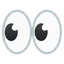
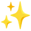
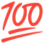
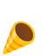
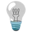
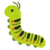

# Emoji noto

[](https://creativecommons.org/licenses/by/4.0/)

---

42 of Google's animated Noto Color Emoji, picked for a comment box.

<p>




</p>


## CDN Link

```
https://cdn.jsdelivr.net/gh/walinejs/emojis/noto
```

## Thanks

Thanks to Google for designing and animating the emoji, and to the Noto team
for confirming the licence in
[googlefonts/noto-emoji#553](https://github.com/googlefonts/noto-emoji/issues/553).
The licence is not stated on the animation site or in the file metadata.

Built with [waline-noto-emoji](https://github.com/wenscodes/waline-noto-emoji),
which will build any selection you want from the 584 that have a gemoji alias.

## License

The emoji are Google's, under
[CC BY 4.0](https://creativecommons.org/licenses/by/4.0/), which is not the
licence the other packs in this repository use. See [LICENSE](./LICENSE) in
this directory: it has to travel with the files wherever they are served.
